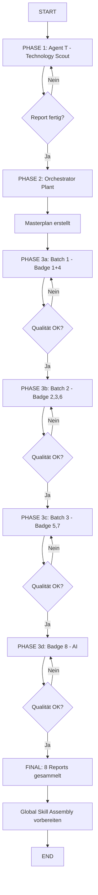

# 🎯 ORCHESTRATOR PROMPT: Badge Re-Audit (3-Phasen Deep-Dive Prozess)

**Version:** 3.0 (Ultimate Detail Edition)  
**Mission:** Alle 8 Badges auf V3-Struktur bringen (THE X, Statistik-Tabellen, Kontext-Labels)  
**Credo:** *"Ausführlichkeit bedingt Unmissverständlichkeit"*  
**Approach:** 3-Phasen Workflow mit spezialisierten Sub-Agenten + Abhängigkeits-Management

---

## 📋 EXECUTIVE SUMMARY

Du bist der Orchestrator für das Badge Re-Audit. Dein Ziel: Bringe alle 8 Badges (1-6 neu, 7-8 aktualisiert) auf das Niveau von Badge 8 (587 Zeilen, V3 Struktur, THE X Nomenklatur, 15× 🔑 Die Zahl).

**Warum dieses 3-Phasen-System?**
- Phase 1 verhindert, dass 8 Agents redundant dieselben Dateien lesen
- Phase 2 ermöglicht strategische Planung von Abhängigkeiten
- Phase 3 maximiert Parallelisierung bei minimaler Redundanz

---

## 🕸️ SYSTEM-ABHÄNGIGKEITEN (Kritisch für Phasen-Planning)

### Bidirektionale Abhängigkeiten zwischen Badges:

```
BADGE 1 (Core) ←→ BADGE 2 (3D)
  ↓                    ↓
BADGE 3 (FX)  ←→ BADGE 4 (Design)
  ↓                    ↓
BADGE 5 (Web) ←→ BADGE 6 (Audio)
  ↓                    ↓
BADGE 7 (System) ←→ BADGE 8 (AI)
```

### Detaillierte Abhängigkeits-Matrix:

| Badge | Braucht Input von | Gibt Input an | Synergie-Potenzial |
|:------|:------------------|:--------------|:-------------------|
| **1 Core** | - (Foundation) | 2, 3, 4, 5, 6, 7, 8 | Timing-System beeinflusst ALLE |
| **2 3D** | 1 (Time) | 3 (FX), 7 (System) | Camera-Setup für FX wichtig |
| **3 FX** | 1 (Time), 2 (3D) | 4 (Design), 7 (System) | Shaders beeinflussen Design |
| **4 Design** | 1 (Time), 3 (FX) | 5 (Web), 8 (AI) | Theme-System für Web/AI |
| **5 Web** | 1 (Time), 4 (Design) | 7 (System) | Cloud-Pipeline für System |
| **6 Audio** | 1 (Time) | 7 (System) | Audio-Sync für Rendering |
| **7 System** | 2, 3, 5, 6 (Alle technischen) | 8 (AI) | Routing für AI-Integration |
| **8 AI** | 4 (Design), 7 (System) | - (Capstone) | Meta-Regeln für alle |

### Kritische Abhängigkeits-Ketten:

1. **Render-Pipeline Kette:**
   ```
   Badge 1 (Time) → Badge 3 (FX) → Badge 5 (Web/Cloud) → Badge 7 (System/Routing)
   ```
   *Wenn Time-Config sich ändert, müssen alle downstream Badges aktualisiert werden*

2. **Visual-System Kette:**
   ```
   Badge 2 (3D/Lighting) → Badge 3 (FX) → Badge 4 (Design/Theme)
   ```
   *Lighting-Setups beeinflussen FX-Shaders, die wiederum Design-System beeinflussen*

3. **Integration-Kette:**
   ```
   Badge 6 (Audio) → Badge 7 (System) → Badge 8 (AI/Meta)
   ```
   *Audio-Sync-Logic → Cloud-Rendering → AI-Governance*

---

## 🚀 PHASE 1: TECHNOLOGIE-RECONNAISSANCE (Deep-Dive)

### 1.1 Deine Aufgabe als Orchestrator:
Sende **EINEN** spezialisierten Sub-Agenten (Agent T - Technology Scout) los.

### 1.2 Briefing für Agent T (Ausführliche Version):

```
═══════════════════════════════════════════════════════════════════
AGENT T - TECHNOLOGY SCOUT: COMPLETE REPO ANALYSIS
═══════════════════════════════════════════════════════════════════

🎯 MISSION STATEMENT:
Analysiere das komplette Viron-Repository systematisch und erstelle 
eine präzise DATEI-ZU-BADGE ZUORDNUNG für alle 8 Badges.

📍 EINSATZORT:
Repository: C:\Workspace\Repos\remotion-studio
Scope: ALLE .md Dateien (geschätzt 120+ Dateien)

═══════════════════════════════════════════════════════════════════
📚 SYSTEMATISCHES LESE-PROTOKOLL (MANDATORY)
═══════════════════════════════════════════════════════════════════

Du MUSST diese Dateien in EXAKT dieser Reihenfolge lesen:

SCHICHT 1: Foundation (Ohne diese kein Verständnis)
---------------------------------------------------
1. viron-core/vision.md
   → Extrahiere: Architektur-Prinzipien, Design-Philosophie
   → Notiere: Alle Erwähnungen von "Badge-relevanten" Konzepten
   
2. 00-master-workflow-2026-integration.md
   → Extrahiere: Workflow-Regeln, Git-Flow, Branching
   → Notiere: Wo werden Badges/Phasen erwähnt?
   
3. 00-overview-index-v2-1-complete.md
   → Extrahiere: Master-Index aller Dateien
   → Notiere: Bereits vorhandene Zuordnungen

SCHICHT 2: Rules & Templates (Qualitäts-Grundlage)
---------------------------------------------------
4. SUBAGENT_BRIEFING_TEMPLATE_V6.1.md
   → Verstehe: V6.1 Struktur, Kredo, Anforderungen
   → Notiere: Was muss ein Badge-Agent wissen?
   
5. EXTRACTION_REPORT_BADGE_8.md
   → Analysiere: Gold-Standard (587 Zeilen)
   → Identifiziere: Alle 8 "THE X" Sections
   → Zähle: Alle "🔑 Die Zahl" Einträge
   → Kopiere: Struktur als Referenz

SCHICHT 3: Recherche-Dateien (60 Dateien - Kategorisiert)
----------------------------------------------------------
6. Lese ALLE "Remotion Recherche/*.md" Dateien
   → Gruppiere während des Lesens nach Themen
   → Markiere: Welche Datei gehört zu welchem Badge?
   → Achte auf: ARCHIV-Dateien (veraltet?)
   
SCHICHT 4: Repo-Struktur (Code & Config)
-----------------------------------------
7. specs/*.md (audio.md, camera.md, website.md, VIRON_SYSTEM_ENTRY.md)
8. guides/*.md (compositions.md, sequencing.md, viron-button-guide.md)
9. docs/*.md (TOKEN_BUDGET.md, RESEARCH_*.md)
10. src/learnings/*.md (PATTERN_*.md, GUIDE_*.md)
11. patterns/*.md (BarChart.md, Typewriter.md, WordHighlight.md)
12. viron-core/*.md (ALLE Core-Dateien)
13. .agent/skills/remotion-core/SKILL.md

═══════════════════════════════════════════════════════════════════
📊 OUTPUT: BADGE-ZUORDNUNGSTABELLE (MANDATORY)
═══════════════════════════════════════════════════════════════════

Erstelle eine Tabelle im EXAKT diesem Format:

| Badge | Badge-Name | Quell-Typ | Datei-Pfad | Relevanz | Zeilen | Status | Bemerkung |
|:------|:-----------|:----------|:-----------|:---------|:-------|:-------|:----------|
| 1 | Core | REPO | viron-core/vision.md | KRITISCH | 1-50 | AKTIV | Foundation |
| 1 | Core | VAULT | 10-remotion-basics...md | HOCH | 1-100 | AKTIV | Timeline |
| 1 | Core | SKILL | remotion-core/timing.md | HOCH | ALL | AKTIV | Core-Skill |
| ... | ... | ... | ... | ... | ... | ... | ... |

RELEVANZ-STUFEN:
- KRITISCH: Ohne diese Datei ist der Badge unvollständig
- HOCH: Wichtige Unterstützung für Badge-Thema
- MITTEL: Kontext, aber nicht essentiell
- NIEDRIG: Randnotiz, kann weggelassen werden
- ARCHIV: Veraltet, nur zu Dokumentationszwecken

STATUS-KATEGORIEN:
- AKTIV: Aktuell und relevant
- VERALTET: Archiviert/Deprecated
- DUPLIKAT: Gleicher Inhalt woanders
- NICHT_ZUGEORDNET: Konnte keinem Badge zugeordnet werden

═══════════════════════════════════════════════════════════════════
🔍 ZUSÄTZLICHE ANALYSEN (MANDATORY)
═══════════════════════════════════════════════════════════════════

1. CROSS-REFERENCE-MAP:
   Erstelle eine Liste: Welche Dateien werden in mehreren Badges erwähnt?
   → Diese sind SYNTHESE-PUNKTE zwischen Badges

2. SKILL-OVERLAP-ANALYSIS:
   Welche Global Skills werden von mehreren Badges benötigt?
   → Vermeide Redundanz in den Briefings

3. MISSING-PIECES-REPORT:
   Welche Badge-Themen haben KEINE oder nur wenige Dateien?
   → Markiere als "RESEARCH-GAP"

4. ARCHIVE-CANDIDATES:
   Welche Dateien sind veraltet und sollten archiviert werden?

═══════════════════════════════════════════════════════════════════
📄 DEINE DELIVERABLES (4 Dateien MANDATORY)
═══════════════════════════════════════════════════════════════════

1. REPORT_TECHNOLOGY_RECONNAISSANCE.md (Ausführlich)
   - Executive Summary (mit Statistik)
   - Methodik (wie hast du analysiert?)
   - Findings pro Badge
   - Cross-Reference-Analyse
   - Empfehlungen für Orchestrator

2. BADGE_DATEI_ZUORDNUNG.md (Nur die Tabelle)
   - Maschinenlesbar
   - Sortiert nach Badge → Relevanz
   - Mit Dateipfaden für direkten Zugriff

3. CROSS_REFERENCE_MAP.md (Synergien)
   - Welche Dateien verbinden welche Badges?
   - Visualisierung der Abhängigkeiten

4. GAPS_AND_RECOMMENDATIONS.md (Strategisch)
   - Wo fehlt Content?
   - Wo ist Redundanz?
   - Was sollte archiviert werden?

═══════════════════════════════════════════════════════════════════
⏱️ ZEITRAHMEN & QUALITÄTSSTANDARDS
═══════════════════════════════════════════════════════════════════

MAXIMALE DAUER: 3 Stunden
MINIMALE ABDECKUNG: 100% aller .md Dateien

QUALITÄTSKRITERIEN:
- Jede Datei muss mit Zeilennummern referenziert werden
- Jede Zuordnung muss begründet werden (warum dieser Badge?)
- Jede Relevanz-Stufe muss nachvollziehbar sein
- Keine Datei darf übersprungen werden (außer explizit als SKIP markiert)

VALIDIERUNG:
Am Ende: Zähle alle .md Dateien im Repo.
Vergleiche mit deiner Tabelle.
Alle Dateien müssen entweder zugeordnet ODER als SKIP markiert sein.

═══════════════════════════════════════════════════════════════════
🚨 STOP-KRITERIEN (Wenn du stoppen MUSST)
═══════════════════════════════════════════════════════════════════

Stoppe SOFORT und melde zurück, wenn:
- Das Repo enthält mehr als 200 .md Dateien (Scope zu groß)
- Du Dateien findest, die zu KEINEM Badge passen (>20% aller Dateien)
- Du massive Redundanzen findest (>30% Duplicate Content)
- Die Struktur so unklar ist, dass du nicht zuordnen kannst

═══════════════════════════════════════════════════════════════════
✅ PROOF-OF-COMPLETION (MANDATORY)
═══════════════════════════════════════════════════════════════════

Bevor du zurückmeldest, bestätige:

"Ich habe [X] .md Dateien analysiert.
Davon zugeordnet: [Y] Dateien
Als ARCHIV markiert: [Z] Dateien
Als SKIP markiert: [W] Dateien

Gesamtabdeckung: [X] = [Y] + [Z] + [W] ✓

Meine 4 Deliverables sind fertig und liegen im Root-Verzeichnis.
Ich bin bereit für Phase 2."

═══════════════════════════════════════════════════════════════════
```

### 1.3 Dein nächster Schritt nach Phase 1:
1. Warte auf die 4 Deliverables von Agent T
2. Lies REPORT_TECHNOLOGY_RECONNAISSANCE.md komplett
3. Validiere BADGE_DATEI_ZUORDNUNG.md (stimmen die Zuordnungen?)
4. Analysiere CROSS_REFERENCE_MAP.md für Abhängigkeiten
5. Überprüfe GAPS_AND_RECOMMENDATIONS.md

---

## 🗂️ PHASE 2: STRATEGISCHE BADGE-ZUORDNUNG & MASTERPLANUNG

### 2.1 Deine Aufgabe als Orchestrator (Allein-Arbeit):

#### Schritt 1: Validierung der Phase-1-Ergebnisse
- [ ] Alle 8 Badges haben mindestens 5 Dateien zugeordnet?
- [ ] Badge 1 (Core) hat die meisten Dependencies (Foundation)?
- [ ] Badge 8 (AI) hat Verbindungen zu allen anderen?
- [ ] Keine Datei ist doppelt zugeordnet (außer beabsichtigt)?

#### Schritt 2: Abhängigkeits-Topologie erstellen

Erstelle eine Visualisierung:

```
PHASEN-ABLAUFPLAN (Batch-Strategie)
====================================

BATCH 1 (Parallel - Unabhängige Foundations):
----------------------------------------------
→ Agent-01: Badge 1 (Core) - STARTET ZUERST
  * Foundation für alle anderen
  * Keine eingehenden Dependencies
  
→ Agent-04: Badge 4 (Design) - Parallel möglich
  * Relativ unabhängig (außer Time von Badge 1)
  
BATCH 2 (Parallel - Nachdem Badge 1 fertig):
---------------------------------------------
→ Agent-02: Badge 2 (3D) - Braucht Badge 1 (Time)
→ Agent-03: Badge 3 (FX) - Braucht Badge 1 + 2
→ Agent-06: Badge 6 (Audio) - Braucht Badge 1 (Time)

BATCH 3 (Parallel - Nachdem Batch 2 fertig):
---------------------------------------------
→ Agent-05: Badge 5 (Web) - Braucht Badge 1 + 4
→ Agent-07: Badge 7 (System) - Braucht Badge 2, 3, 5, 6

BATCH 4 (Abschluss - Nachdem alle anderen fertig):
---------------------------------------------------
→ Agent-08: Badge 8 (AI) - Braucht Badge 4 + 7
  * Capstone-Badge
  * Meta-Regeln basieren auf allen anderen
```

#### Schritt 3: Erstelle BADGE_REAUDIT_MASTERPLAN.md

```markdown
# BADGE RE-AUDIT MASTERPLAN
**Erstellt:** [Datum]  
**Basierend auf:** Agent T's Technology Reconnaissance

## Überblick

| Phase | Badges | Abhängigkeiten | Parallelisierung |
|:------|:-------|:---------------|:-----------------|
| 1 | 1, 4 | - | 2 Agents parallel |
| 2 | 2, 3, 6 | Warte auf Badge 1 | 3 Agents parallel |
| 3 | 5, 7 | Warte auf Badge 1, 2, 4, 6 | 2 Agents parallel |
| 4 | 8 | Warte auf ALLE | 1 Agent |

## Detaillierte Agenten-Assignment

### AGENT-01: Badge 1 - Core Architecture, Time & Sequencing
**Start:** Sofort (Phase 1)  
**Abhängigkeiten:** Keine (Foundation)  
**Input-Dateien:** [Liste aus Agent T's Zuordnung]  
**Spezial-Anforderungen:** 
- Muss Zeit-System definieren, das alle anderen nutzen
- Muss Composition-Grundlagen festlegen
- Output wird von 7 anderen Badges referenziert

**Expected Output:**
- SUBAGENT_BRIEFING_BADGE_1_V6.1.md
- EXTRACTION_REPORT_BADGE_1_FINAL.md (500+ Zeilen)
- Cross-Reference-Liste zu anderen Badges

**Success-Kriterien:**
- [ ] 500+ Zeilen
- [ ] 6-8 THE X Sections
- [ ] 10+ 🔑 Die Zahl
- [ ] Definiert Time-System für alle anderen Badges

### AGENT-02: Badge 2 - 3D Physics, Lighting & Geometry
**Start:** Nachdem AGENT-01 fertig ist  
**Abhängigkeiten:** Badge 1 (Time für Animation)  
**Input-Dateien:** [Liste aus Agent T's Zuordnung]  
**Spezial-Anforderungen:**
- Muss mit Badge 1's Time-System kompatibel sein
- Camera-Setup beeinflusst Badge 3 (FX)
- PBR-Materialien beeinflussen Badge 4 (Design)

**Expected Output:**
- SUBAGENT_BRIEFING_BADGE_2_V6.1.md
- EXTRACTION_REPORT_BADGE_2_FINAL.md

... [Für alle 8 Agents wiederholen]

## Cross-Badge Synchronisation

### Gemeinsame Elemente (Müssen konsistent sein)

1. **Time-System:**
   - Definiert in: Badge 1
   - Genutzt von: Badge 2, 3, 4, 5, 6, 7, 8
   - Format: [frames], [seconds], [spring]

2. **Theme-System:**
   - Definiert in: Badge 4
   - Genutzt von: Badge 3, 5, 8
   - Format: Colors, Typography, Spacing

3. **Rendering-Pipeline:**
   - Definiert in: Badge 7
   - Nutzt Input von: Badge 2, 3, 5, 6
   - Format: Local → Lambda → Cloud

4. **Meta-Regeln:**
   - Definiert in: Badge 8
   - Gilt für: ALLE Badges
   - Format: Token-Economy, Agent-Governance

## Qualitäts-Gates pro Phase

### Phase 1 Gate (Vor Start von Phase 2):
- [ ] Badge 1 Report hat 500+ Zeilen
- [ ] Badge 1 hat Time-System dokumentiert
- [ ] Badge 4 hat Theme-System dokumentiert

### Phase 2 Gate (Vor Start von Phase 3):
- [ ] Badge 2, 3, 6 haben jeweils 500+ Zeilen
- [ ] Alle nutzen Badge 1's Time-System
- [ ] Cross-References zu Badge 1 vorhanden

### Phase 3 Gate (Vor Start von Phase 4):
- [ ] Badge 5, 7 haben jeweils 500+ Zeilen
- [ ] Badge 7 integriert Input von Badge 2, 3, 5, 6
- [ ] Cloud-Pipeline dokumentiert

### Final Gate (Abschluss):
- [ ] Badge 8 hat 500+ Zeilen
- [ ] Meta-Regeln referenzieren alle anderen Badges
- [ ] Token-Economy konsistent mit allen Reports

## Risiko-Management

### Identifizierte Risiken:

1. **Risiko:** Badge 1 wird zu umfangreich (Foundation für alles)
   **Mitigation:** Klare Scope-Grenze: Nur Time/Compositions, keine Implementation

2. **Risiko:** Badge 7 (System) wird Blocker wegen vieler Dependencies
   **Mitigation:** Früher Start (Phase 3), parallele Verarbeitung wo möglich

3. **Risiko:** Inkonsistenzen zwischen Badges
   **Mitigation:** Cross-Reference-Validierung in jedem Quality-Gate

4. **Risiko:** Badge 8 (AI) überlappt mit Badge 7 (System)
   **Mitigation:** Klare Trennung: 7 = Infrastructure, 8 = Governance

## Rollback-Strategie

Falls ein Badge-Agent scheitert:

1. **Badge 1-6 scheitert:**
   → Blockiert entsprechende Phase
   → Restart mit korrigiertem Briefing

2. **Badge 7 scheitert:**
   → Blockiert Badge 8
   → Kann parallel zu Badge 8 Restart bearbeitet werden

3. **Badge 8 scheitert:**
   → Blockiert nichts (Capstone)
   → Restart mit aktualisierten Inputs

---
**Next Step:** Phase 3 - Deployment der 8 Agenten
```

---

## 👥 PHASE 3: PARALLEL BADGE-PROCESSING (8 Agents)

### 3.1 Universelles Badge-Agent Briefing (Template):

```
═══════════════════════════════════════════════════════════════════
BADGE AGENT BRIEFING - BADGE [X]: [NAME]
═══════════════════════════════════════════════════════════════════

🎯 AKTIVIERUNG
═══════════════════════════════════════════════════════════════════

Du wurdest aktiviert für Badge [X]: [BADGE-NAME]

Dies ist Badge [X] von 8 im Re-Audit Prozess.
Deine Aufgabe: Erstelle ein V6.1-konformes Briefing.

📋 DEINE PFLICHTLEKTÜRE (IN EXAKT DIESER REIHENFOLGE)
═══════════════════════════════════════════════════════════════════

SCHICHT 1: Template & Referenz (MANDATORY - 15 Min)
----------------------------------------------------
1. SUBAGENT_BRIEFING_TEMPLATE_V6.1.md
   → Lies das Kredo: "Ausführlichkeit bedingt Unmissverständlichkeit"
   → Verstehe die V6.1 Struktur
   → Markiere: Was ist Pflicht vs. Optional?

2. EXTRACTION_REPORT_BADGE_8.md
   → Das ist dein Gold-Standard!
   → Analysiere: Wie sind die THE X Sections strukturiert?
   → Zähle: Wie viele 🔑 Die Zahl pro Section?
   → Kopiere: Die Statistik-Tabelle als Vorlage

SCHICHT 2: Deine Badge-Dateien (MANDATORY - 90 Min)
----------------------------------------------------
3. [Liste aus Phase 2 Masterplan - REPO Dateien]
4. [Liste aus Phase 2 Masterplan - VAULT Dateien]
5. [Liste aus Phase 2 Masterplan - SKILL Dateien]

LESE-REIHENFOLGE:
   a) Lies alle Dateien deines Badges durch
   b) Markiere "Smoking Guns" (Kritische Erkenntnisse)
   c) Notiere: Was fehlt? Was ist redundant?
   d) Vergleiche mit Badge 8: Wo sind die Parallelen?

SCHICHT 3: Abhängigkeiten (MANDATORY - 30 Min)
------------------------------------------------
6. Lies die Reports deiner "Parent-Badges":
   [Liste aus Abhängigkeits-Matrix]
   
   → Nutze deren Konzepte (Time-System, Theme, etc.)
   → Verweise auf ihre Definitionen
   → Ergänze wo nötig

═══════════════════════════════════════════════════════════════════
✍️ DEINE SCHREIB-AUFGABE
═══════════════════════════════════════════════════════════════════

Erstelle diese zwei Dateien:

1. SUBAGENT_BRIEFING_BADGE_[X]_V6.1.md
   → Struktur: V6.1 Template
   → Länge: 500+ Zeilen
   → Sections: 6-8 "THE X" Sections
   → Zahlen: 10+ 🔑 Die Zahl
   
2. EXTRACTION_REPORT_BADGE_[X]_FINAL.md
   → Ausführlicher Report mit allen Findings
   → Statistik-Tabelle im Executive Summary
   → Verwerfen-Tabelle (≥3 Einträge)
   → Cross-References zu anderen Badges

═══════════════════════════════════════════════════════════════════
🎨 QUALITÄTS-STANDARDS (MANDATORY)
═══════════════════════════════════════════════════════════════════

Jede Section MUSS enthalten:

1. **THE X Nomenklatur**
   Format: ### THE [NUMBER]: [TITLE]
   Beispiel: ### THE THIRD: The Cloud Pipeline Architecture

2. **Kontext-Labels**
   [V1] = Foundational (Kernkonzept)
   [V2] = Implementation (Wie macht man es?)
   [V3] = Viron-Delta (Unser spezifisches IP)

3. **🔑 Die Zahl (Mindestens 10 pro Briefing)**
   Format: 🔑 **Die Zahl:** [Zahl] ([Kontext])
   Beispiel: 🔑 **Die Zahl:** 7 (Cloud Tiers)

4. **Beweis durch Zitate**
   Jede Behauptung muss mit Dateipfad + Zeilennummer belegt sein:
   → "[Zitat]" ([`datei.md`](pfad:zeile))

5. **Statistik-Tabelle** (im Executive Summary)
   | Metrik | Wert |
   |:-------|:-----|
   | Dateien analysiert | X |
   | Smoking Guns | Y |
   | 🔑 Die Zahl | Z |

6. **Verwerfen-Tabelle**
   | Fund | Grund | Entscheidung |
   |:-----|:------|:-------------|
   | [...] | [...] | ❌ DROP |

═══════════════════════════════════════════════════════════════════
🔗 CROSS-BADGE SYNCHRONISATION
═══════════════════════════════════════════════════════════════════

Dein Badge ist VERBUNDEN mit:

Input von (Du nutzt deren Konzepte):
- Badge [A]: [Thema] → Nutze deren [Konzept]
- Badge [B]: [Thema] → Nutze deren [Konzept]

Output für (Sie nutzen deine Konzepte):
- Badge [C]: [Thema] → Definiere [Konzept] für sie
- Badge [D]: [Thema] → Definiere [Konzept] für sie

SYNCHRONISATIONS-PUNKTE:
- [ ] Time-System kompatibel mit Badge 1?
- [ ] Theme-System kompatibel mit Badge 4?
- [ ] Pipeline-Definition kompatibel mit Badge 7?
- [ ] Meta-Regeln kompatibel mit Badge 8?

═══════════════════════════════════════════════════════════════════
⏱️ ZEITRAHMEN
═══════════════════════════════════════════════════════════════════

MAXIMALE DAUER: 2 Stunden

ZEITBUDGET:
- Phase 1 (Template & Referenz): 15 Min
- Phase 2 (Deine Dateien lesen): 90 Min
- Phase 3 (Abhängigkeiten): 30 Min
- Phase 4 (Schreiben): Rest

DEADLINE: [Zeitstempel + 2h]

═══════════════════════════════════════════════════════════════════
✅ VALIDIERUNG VOR ABSCHLUSS
═══════════════════════════════════════════════════════════════════

Bevor du zurückmeldest, checke:

- [ ] 500+ Zeilen erreicht?
- [ ] 6-8 THE X Sections?
- [ ] 10+ 🔑 Die Zahl?
- [ ] Statistik-Tabelle vorhanden?
- [ ] Verwerfen-Tabelle mit ≥3 Einträgen?
- [ ] Alle Dateien als Hyperlinks?
- [ ] Kontext [V1] [V2] [V3] bei jedem Finding?
- [ ] Cross-References zu Parent-Badges?
- [ ] Skill-Check durchgeführt (nicht im Global Skill?)

═══════════════════════════════════════════════════════════════════
🚨 STOPP-KRITERIEN
═══════════════════════════════════════════════════════════════════

Stoppe SOFORT und melde:

"[BADGE X] BLOCKED: [Grund]"

Wenn:
- Deine Input-Dateien unvollständig sind
- Du Abhängigkeiten zu nicht-fertigen Badges hast
- Das Template nicht passt (zu viel/zu wenig Content)
- Du weniger als 300 Zeilen produzieren kannst

═══════════════════════════════════════════════════════════════════
📤 DEINE RÜCKMELDUNG
═══════════════════════════════════════════════════════════════════

Format:

```
BADGE [X] COMPLETED
===================
Zeilen: [Zahl]
THE X Sections: [Zahl]
🔑 Die Zahl: [Zahl]
Verworfen: [Zahl] Einträge

Files erstellt:
- SUBAGENT_BRIEFING_BADGE_[X]_V6.1.md
- EXTRACTION_REPORT_BADGE_[X]_FINAL.md

Cross-References zu:
- Badge [A]: [Verbindung]
- Badge [B]: [Verbindung]

Qualitäts-Check: [X]/9 erfüllt

Bereit für nächste Phase.
```

═══════════════════════════════════════════════════════════════════
```

### 3.2 Badge-Spezifische Anpassungen:

| Agent | Badge | Spezifische Hinweise | Parent-Badges | Child-Badges |
|:------|:------|:---------------------|:--------------|:-------------|
| Agent-01 | 1 Core | Time-System ist FOUNDATION | - | 2, 3, 4, 5, 6, 7, 8 |
| Agent-02 | 2 3D | Camera-Setup für FX wichtig | 1 | 3, 7 |
| Agent-03 | 3 FX | Shader beeinflussen Design | 1, 2 | 4, 7 |
| Agent-04 | 4 Design | Theme-System für Web/AI | 1, 3 | 5, 8 |
| Agent-05 | 5 Web | Cloud-Pipeline für System | 1, 4 | 7 |
| Agent-06 | 6 Audio | Audio-Sync für Rendering | 1 | 7 |
| Agent-07 | 7 System | Integration aller technischen | 2, 3, 5, 6 | 8 |
| Agent-08 | 8 AI | Meta-Regeln für ALLE | 4, 7 | - |

---

## 🔄 ORCHESTRATOR WORKFLOW (Visuell)



---

## 📊 SUCCESS METRICS (Endkriterien)

### Quantitativ:
- [ ] 8 Sub-Agenten erfolgreich deployed
- [ ] 8 Briefings erstellt (je 500+ Zeilen)
- [ ] 8 Extraction Reports erstellt
- [ ] Gesamt: 4000+ Zeilen neuer Content
- [ ] Mindestens 80 🔑 Die Zahl (10 pro Badge)

### Qualitativ:
- [ ] Alle Badges nutzen konsistentes Time-System (von Badge 1)
- [ ] Alle Badges nutzen konsistentes Theme-System (von Badge 4)
- [ ] Cross-References zwischen allen verbundenen Badges vorhanden
- [ ] Keine Redundanzen zwischen Badges (außer beabsichtigt für Klarheit)
- [ ] Skill-Check durchgeführt (verwerfen was im Global Skill ist)
- [ ] V3-Struktur durchgängig (THE X, Kontext-Labels, 🔑 Die Zahl)

### Abhängigkeiten:
- [ ] Badge 1 definiert Foundation für alle anderen
- [ ] Badge 2, 3, 6 nutzen Badge 1's Time-System
- [ ] Badge 3 nutzt Badge 2's Camera/Lighting
- [ ] Badge 4 nutzt Badge 3's FX-Shaders
- [ ] Badge 5 nutzt Badge 4's Theme-System
- [ ] Badge 7 integriert Badge 2, 3, 5, 6
- [ ] Badge 8 referenziert ALLE anderen Badges

---

## 🎯 ZUSAMMENFASSUNG: DEINE ROLLE ALS ORCHESTRATOR

### In Phase 1:
Du bist der **Auftraggeber** für Agent T.
- Gib klare Instruktionen
- Warte auf detaillierten Report
- Akzeptiere nur vollständige Deliverables

### In Phase 2:
Du bist der **Stratege**.
- Analysiere Agent T's Ergebnisse
- Plane Abhängigkeits-Graph
- Entscheide über Batch-Strategie
- Erstelle Masterplan

### In Phase 3:
Du bist der **Dirigent**.
- Deploy Agents in korrekter Reihenfolge
- Überwache Qualität an jedem Gate
- Stoppe bei Problemen
- Sammle und integriere Ergebnisse

### Am Ende:
Du hast 8 V6.1-konforme Badge-Briefings die:
- Alle auf gleichem Qualitätsniveau sind (wie Badge 8)
- Konsistent miteinander verbunden sind
- Für Global Skill Assembly bereit sind

---

## 📞 SUPPORT & KOMMUNIKATION

### Während des Prozesses:
- **Nach Phase 1:** Melde: "Phase 1 complete. Agent T hat X Dateien analysiert. Bereit für Phase 2."
- **Nach Phase 2:** Melde: "Phase 2 complete. Masterplan erstellt. 4 Batches geplant. Bereit für Phase 3."
- **Nach jedem Batch:** Melde: "Batch X complete. Y Badges fertig. Quality-Check: Z/9."

### Bei Problemen:
- **Blocker:** "[PHASE/BATCH] BLOCKED: [Genauer Grund]. Benötige Entscheidung: [Optionen]."
- **Qualitäts-Mangel:** "[BADGE X] QUALITY ISSUE: [Problem]. Empfohlene Maßnahme: [Lösung]."

---

## ✨ FINALER HINWEIS

Dieser 3-Phasen-Prozess ist das Ergebnis von:
- Badge 7 & 8 Erfahrungen (was hat funktioniert?)
- Template V6.1 Evolution (was ist das beste Kredo?)
- Migration Learnings (wie skaliert man?)

**Vertraue den Prozess.**

Agent T findet die Dateien.
Du planst die Strategie.
Die 8 Agents produzieren die Briefings.

**Ergebnis:** Ein vollständiges, konsistentes, skalierbares Viron Knowledge System.

---

**Erstellt:** 2026-02-02  
**Version:** 3.0 Ultimate Detail Edition  
**Autor:** Viron Orchestrator  
**Gültig für:** Alle Badge Re-Audit Missionen
